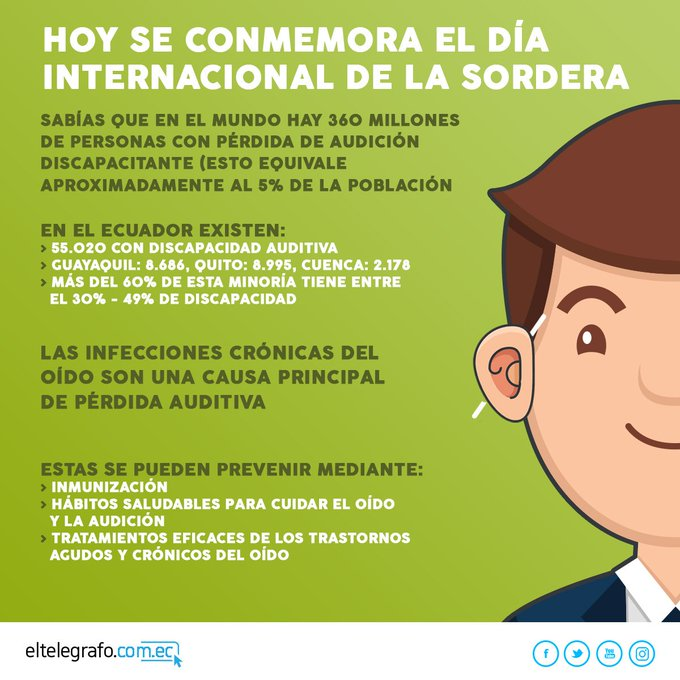

# # La discapacidad auditiva afecta a 360 millones de personas en el mundo

La Organización Mundial de la Salud (OMS) especificó que más del 5% de la población mundial, es decir 360 millones de personas, padece pérdida de audición discapacitante. Entre ellos, 328 millones son adultos y 32 millones niños.

Jimmy Coloma, técnico territorial del Guayas en el Consejo Nacional de Discapacidades (Conadis), explicó que el pasado lunes en Guayaquil se realizó una mesa intersectorial para abordar los avances y desafíos con respecto a la discapacidad auditiva en el país. En este espacio se dieron cita representantes del Ministerio de Inclusión Económica y Social (MIES), Ministerio de Educación (MinEc), Ministerio de Salud Pública (MSP), Conadis y Fe y Alegría.

## Pérdida de la audición

Se dice que alguien sufre pérdida de audición cuando no es capaz de oír tan bien como una persona cuyo sentido del oído es normal, **es decir, cuyo umbral de audición en ambos oídos es igual o superior a 25 dB.**

La pérdida de audición puede ser leve, moderada, grave o profunda. Afecta a uno o ambos oídos y entraña dificultades para oír una conversación o sonidos fuertes. **Las causas de pérdida de audición y sordera se pueden dividir en congénitas y adquiridas.**

## Detección y tratamiento

La detección e intervención tempranas son fundamentales para minimizar las consecuencias de la pérdida de audición, en el desarrollo y el rendimiento escolar del niño.

En los lactantes y niños pequeños con pérdida de audición, la detección y el tratamiento tempranos en el marco de programas de detección auditiva neonatal pueden mejorar los resultados lingüísticos y escolares del niño.

La detección de las enfermedades del oído y la pérdida de audición en los ámbitos preescolar, escolar y profesional también es una herramienta eficaz para identificar y tratar la pérdida de audición en una etapa temprana.

El reconocimiento oficial de los lenguajes de signos nacionales y el aumento del número de intérpretes de esos lenguajes es importante para mejorar el acceso a los servicios de lenguaje de signos.

La visita fue anunciada a través de lal cuenta oficial de twitter del primer mandatario en este [eltelegrafo](https://www.eltelegrafo.com.ec/noticias/sociedad/6/la-discapacidad-auditiva-afecta-a-360-millones-de-personas-en-el-mundo).