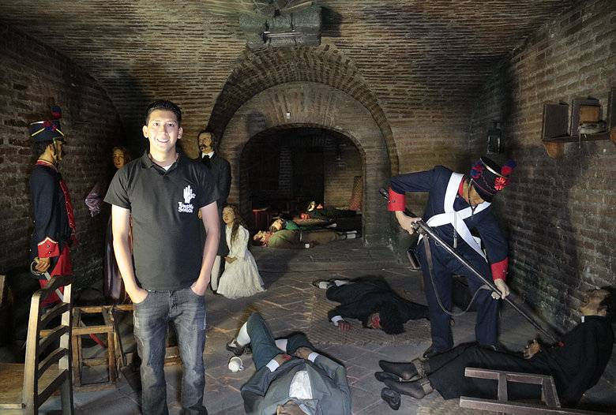
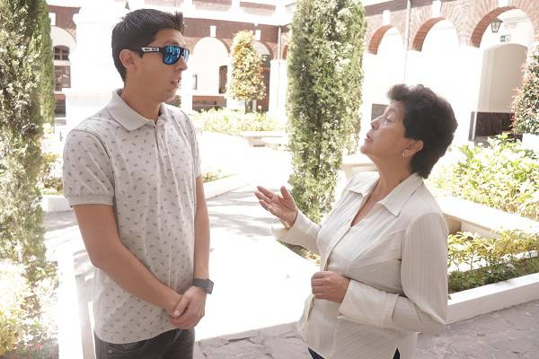

# Comunidad sorda en Ecuador: Un mundo de señas, silencio y lucha

EL UNIVERSO se contactó con algunos personajes con discapacidad auditiva para conocer un poco más de su día a día y cómo aportan a su comunidad. **“Hola soy Leo, tu guía”,** la presentación que da paso a una invitación especial al Museo de Cera.

El rincón que recuerda la primera biblioteca pública de la Real Audiencia de Quito es tomado por un guía que reemplaza las palabras por movimientos con las manos, su mayor instrumento de comunicación.

Este viaje cultural es recogido en un video de cinco minutos.

Se trata de **Leonardo Figueroa de 27 años,** un joven que ideó una guía interactiva en lengua de señas de los museos de Quito.

## El silencio no le impidió conseguir su título profesional

Al principio **Leonardo Figueroa no la tuvo fácil,** entablar una conversación con sus compañeros resultaba todo un reto.

**Así lo asegura su maestro Maldonado,** quien dedicaba los últimos 30 minutos para reforzar las clases con él. Esto con el propósito de garantizar su comprensión puesto que su materia demandaba empleo de códigos de programación.

