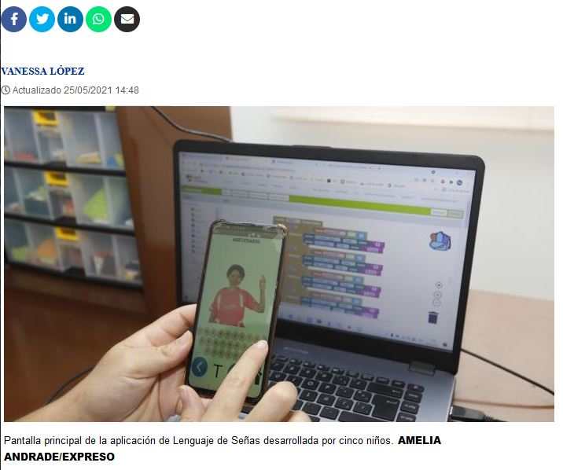

# Una app para aprender el lenguaje de señas, el logro de cinco niños ecuatorianos

Los pequeños, quienes reciben talleres de robótica y programación de forma virtual, se entusiasmaron con la idea de aportar con sus conocimientos a la sociedad. La descarga y el uso de la app es gratis

¿Cómo se dice ‘color rojo’ en lenguaje de señas? Te llevas el puño de la mano hasta la nariz. ¿Cómo se dice ‘color negro’? Abres la palma de la mano y enseguida comprimes los dedos a excepción del pulgar. Estas interpretaciones y muchas más, se pueden aprender de manera graficada y con movimientos, a través de una **aplicación móvil (app) gratuita llamada Lengua de Señas EC,** que crearon cinco niños como aporte a la inclusión de Ecuador.

Fue así que, durante dos semana, cada uno de los menores dedicó más de una horas al día en el desarrollo de una parte de la aplicación: Luciana hizo el diseño de la aplicación; Juan Pablo se encargó de la programación de cada letra; Josué le dio el movimiento a los botones y dinamismo a las imágenes; y Nicolás y Diego programaron la aplicación en Scratch (software de programación para juegos y videojuegos).

El resultado: Una aplicación **colorida, dinámica** y ordenada, que tiene en su pantalla de entrada, cuatro íconos que llevan al usuario a una lista de colores y figuras que al presionar revelan con señales manuales la interpretación de las palabras en el lenguaje de señas.

“En un año tenemos pensado retomar con más fuerza este proyecto y agregarle más botones y opciones de aprendizaje de lenguaje de señas. Nosotros los maestros dimos la idea, pero ellos desarrollaron cada detalle, hicieron todo. Lo que queremos, como guías, es que los niños ya no solo sean consumidores de tecnología, sino que también sean creadores de ella. Y ahora ellos ya saben cómo usar sus conocimientos para aportarle al mundo”, concluyó Patricio, el profesor de programación.

**SEGUIR LEYENDO:**

[Aplicación móvil (app) gratuita llamada Lengua de Señas EC](https://www.expreso.ec/ciencia-y-tecnologia/aplicacion-movil-aprender-lenguaje-senas-ninos-ecuador-app-105126.html)

[Lengua de Señas EC, que crearon cinco niños como aporte a la inclusión de Ecuador.](https://twitter.com/Expresoec/status/1397301447025336320)